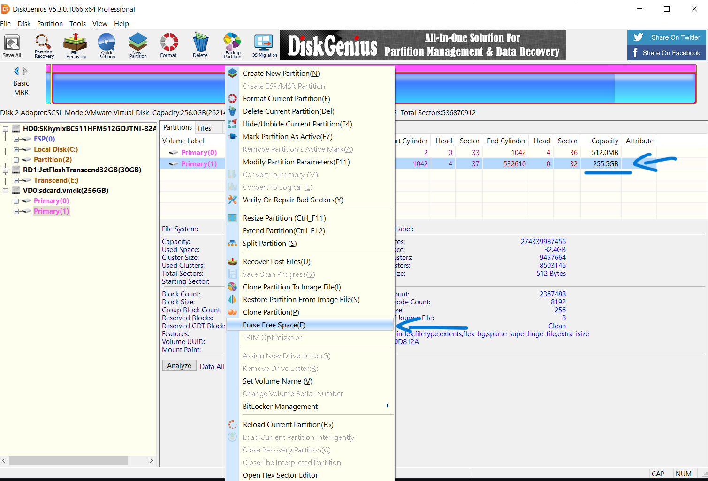
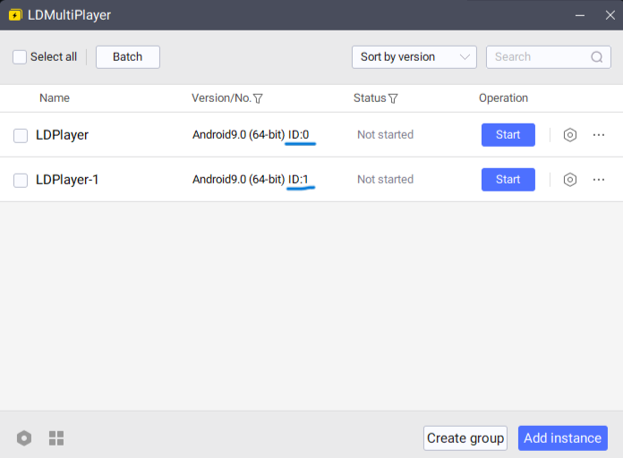

# ShrinkLDPlayer

## Note

This also works on other emulators as long as it's a VMDK. If you need help with that, feel free to open an issue.

## Pre-Requisites

VMware workstation, specifically the `vmware-vdiskmanager.exe` file.

> [!NOTE]
> If you don't have VMware workstation or don't want to download the whole thing, simply use the `vmware-vdiskmanager.exe` file from the VdiskManager folder i provided (This is a new addition).

## Instructions - Which version to use?

### Quick version (requires you to install an app)

1. If you have DiskGenius or are willing to install it, please refer to the [DiskGenius version](#diskgenius-version)

### ADB version

1. If you have changed the directories mentioned below from their default installations (`C:\LDPlayer\LDPlayer9` and `C:\Program Files (x86)\VMware\VMware Workstation`), please refer to the [Manual version](#manual-version) of the instructions and ensure that you update the commands accordingly.
2. If you have not changed the directories, please refer to the [Batch (.bat) files version](#batch-bat-files-version).
3. You can also [Edit the batch files](#editing-batch-files) and replace directories with your own.

> [!NOTE]
> I recommend using the manual version since it seems to clear more storage.

## DiskGenius Version

1. In DiskGenius, go to `Disk > Open Virtual Disk File` and choose the VMDK you want to shrink. (VMDKs are saved at \LDPlayer\LDPlayer9\vms\leidian#, # being the id of the instance (taken from ldmultiplayer), for example leidian1, leidian1 etc.).
2. Under Partitions, right-click the larger partition and choose `Erase Free Space`. Keep the settings unchanged and then click Erase.\
   
3. Wait until it says Complete instead of Cancel and close the app. (This part might take quite some time and it might look like it's stuck but don't worry, if you see that it's using cpu in task manager then it's still working).
4. In file explorer, go to where `vmware-vdiskmanager.exe` is, right-click and choose open in terminal (or cmd or powershell).
5. Use the command `vmware-vdiskmanager.exe -k C:\Path\to\file.vmdk` (for cmd) or `& vmware-vdiskmanager.exe -k C:\Path\to\file.vmdk` (for Powershell) and replace C:\Path\to\file.vmdk with the path to the VMDK you're shrinking.

## Batch (.bat) files version

> - Please note, this process only applies if you have installed the programs in their default installation locations.
> - The vmdk should shrink by 1GB. If you want to shrink it more, you can increase the count in Clear.bat from 1024 (1GB) to a bigger number (You can go overboard, it won't delete files you never deleted).

1. Launch the LDPlayer instance you want to shrink.
2. In "Settings > Other settings > ADB debugging" choose "Open local connection", also make sure Root Permission is enabled.
3. Without closing the emulator, run `StorageClear.bat`.
4. Figure out the ID of the LDPlayer instance you want to shrink by going to LDMultiPlayer and checking the IDs.
   
5. Close LDPlayer completely and run `Shrink.bat`, it'll ask for the ID acquired in the previous step.

- The same steps apply for the Data version of the batch files (`StorageClearData.bat` and `ShrinkData.bat`)

If you get any errors, maybe try the manual version.

## Manual version

> - You can also refer to [Editing batch files](#editing-batch-files) to make your own batch files
> - The vmdk should shrink by 1GB. If you want to shrink it more, you can increase the count in step 9 from 1024 (1GB) to a bigger number (You can go overboard, it won't delete files you never deleted).

1. Launch the LDPlayer instance you want to shrink.
2. In "Settings > Other settings > ADB debugging" choose "Open local connetion", also make sure Root Permission is enabled.
3. Without closing the emulator, open cmd/powershell.
4. Change directory to where LDPlayer is installed using `cd C:\LDPlayer\LDPlayer9`.
5. Run the command `adb devices` (cmd) or `.\adb devices` (powershell). If the output lists a device (emulator-5556 device) then you're good to go if not make sure step 2 is done and the LDPlayer instance is Launched.
6. Run `adb shell` (cmd) or `.\adb shell` (powershell).
7. Go into superuser using `su`.
8. Change directory to sdcard using `cd /sdcard`.
9. Create a file filled with zeros using `dd if=/dev/zero of=fillfile bs=1048576 count=1024` (As said above, you can change 1024 (1GB) to a bigger number. Even if the number is bigger than how large the instance is, it won't delete anything (This ensures clearing the most space possible)).
10. Delete the created file using `rm /sdcard/fillfile`.
11. Exit out of shell session using `exit`.
12. Exit the ADB session using `exit`.
13. Shut down LDPlayer.
14. Look for where the instance is saved. `C:\LDPlayer\LDPlayer9\vms` by default (You can tell which instance is which by the name of the folders (leidian0, leidian1 etc) and the ID in LDMultiPLayer).
15. Inside of that instance folder there will be three vmdk files, `system.vmdk` is the one you probably should not shrink.
16. Since in steps 8 and 12 we used the sdcard directory, we'll be shrinking sdcard.vmdk using `vmware-vdiskmanager.exe` which is available in the vmware workstation directory `C:\Program Files (x86)\VMware\VMware Workstation`.
17. Open cmd or powershell and change directory to where `vmware-vdiskmanager.exe` is and run `vmware-vdiskmanager.exe -k "C:\LDPlayer\LDPlayer9\vms\leidian1\sdcard.vmdk"` (cmd) or `.\vmware-vdiskmanager.exe -k "C:\LDPlayer\LDPlayer9\vms\leidian1\sdcard.vmdk"` (powershell). Don't forget to change "leidian1" depending on the instance you want to shrink.
18. To shrink data.vmdk, replace sdcard in steps 8, 9 and 17 with data

Refer to [Editing Batch files](#editing-batch-files) to make your own batch files.

## Editing Batch files

> Instead of following the steps in the [Manual version](#manual-version), you can edit the paths in the batch files and use the [Batch (.bat) files version](#batch-bat-files-version) instead.

### StorageClear.bat file

- Replace `C:\LDPlayer\LDPlayer9` with the path to your LDPlayer installation (if there are spaces dont forget the double quotes (ex: `C:\Path to\LDPlayer` would be `"C:\Path to\LDPlayer"`).
- You can replace 1024 in `count=1024` with a bigger number to clear more space (You can go overboard, it won't delete files you never deleted).

### Shrink.bat file

- For VMWare you should replace `"C:\Program Files (x86)\VMware\VMware Workstation\vmware-vdiskmanager.exe"` with the path to your `vmware-vdiskmanager.exe` file.
- For LDPlayer you should replace `C:\LDPlayer\LDPlayer9\vms\leidian` with the path to your LDPlayer vms (NOTE: \LDPlayer\LDPlayer9\vms\leidian is unchangeable. This means that, say you installed LDPlayer in your downloads folder, your path should be `C:\Users\YOUR-USERNAME\Downloads\LDPlayer\LDPlayer9\vms\leidian` (of course YOUR-USERNAME should be replaced with your username)).
- Make sure to set the LDPlayer path with no double quotes since it is getting added in the end.
